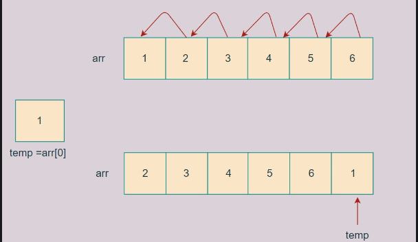

# DSA-PROBLEMS

**TOPIC: ARRAY**

## 1. Find the Largest element in an array [click here](https://www.naukri.com/code360/problems/largest-element-in-the-array-largest-element-in-the-array_5026279?utm_source=youtube&utm_medium=affiliate&utm_campaign=striver_Arrayproblems)
**Approach:**
1. assume a[0]= larger.
2. compare with other element.
3. a[i]>larger .print a[i]= largest.
  
**SOLUTION:** IN JAVA
```java
import java.util.* ;
import java.io.*; 

public class Solution {

    static int largestElement(int[] arr, int n) {
        int largestElement=arr[0];
        for(i =0;i<n-1;i++){
            largestElement=arr[i];

        }
        print(largestElement)

    }
}
```

1.Time Complexity:  **O(n)** <br/>
2. Space Complexity:  **O(1)**

[**Refer this**](https://youtu.be/37E9ckMDdTk?si=wHRlktwzjngsqNuk)
--
## 4. Left Rotate the Array by One[click here](https://www.naukri.com/code360/problems/left-rotate-an-array-by-one_5026278?utm_source=youtube&utm_medium=affiliate&utm_campaign=striver_Arrayproblems&leftPanelTabValue=SUBMISSION)
**Approach:**
1. take a[0] as temp
2. iterate the array from the 0th index to the n-1th index(to prevent its segmentation fault we will iterate it till n-1.)
3. put the value of temp  in the last index of the array.(a[n-1])


**SOLUTION:** IN JAVA
```java
import java.util.* ;
import java.io.*; 


public class Solution {

    static int[] rotateArray(int[] arr, int n)
     {
       int temp=arr[0];
       for(int i=0;i<n-1;i++){
           arr[i]=arr[i+1];
       }
       arr[n-1]=temp;
       return arr;

    
  
     }
}
```

1.Time Complexity:  **O(n)** <br/>
2. Space Complexity:  **O(1)**

[**Refer this**](https://youtu.be/wvcQg43_V8U?si=FZ6ZdKo2Kyw7alht)


